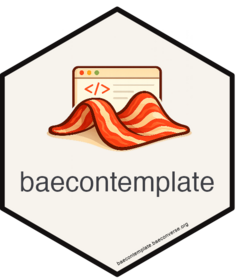

<!-- README.md is generated from README.Rmd. Please edit that file -->

```{r, include = FALSE}
knitr::opts_chunk$set(
  collapse = TRUE,
  comment = "#>",
  fig.path = "man/figures/README-",
  out.width = "100%"
)
```

# baecontemplate 

<!-- badges: start -->
<!-- badges: end -->

## Overview

`baecontemplate` is the pkgdown template for baeconverse packages.

